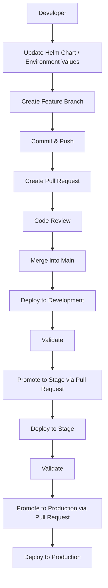

## Promotion Workflow

```mermaid
flowchart TD
    A[Developer] --> B[Update Helm Chart / Environment Values]
    B --> C[Create Feature Branch]
    C --> D[Commit & Push]
    D --> E[Create Pull Request]
    E --> F[Code Review]
    F --> G[Merge into Main]
    G --> H[Deploy to Development]
    H --> I[Validate]
    I --> J[Promote to Stage via Pull Request]
    J --> K[Deploy to Stage]
    K --> L[Validate]
    L --> M[Promote to Production via Pull Request]
    M --> N[Deploy to Production]
```
